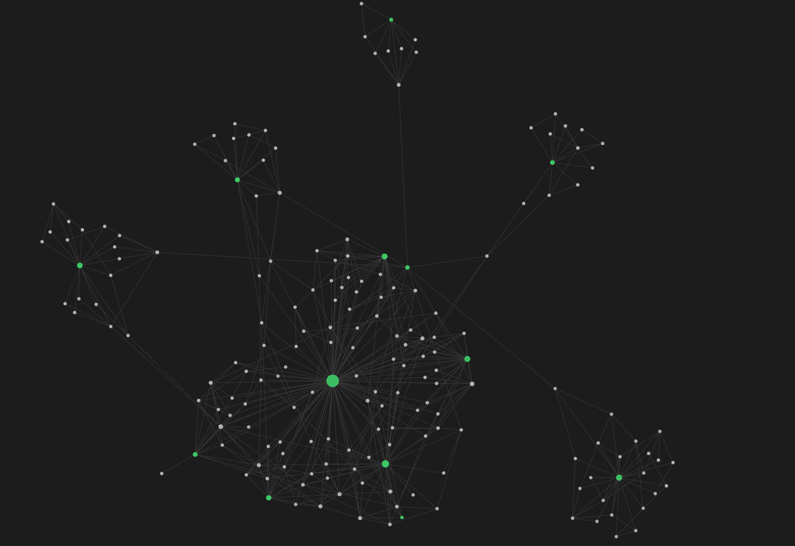

# mind_base_manager
## We are mapping knowledge as a hard dependency graph.
A map is only as good as the added value it provides. We develop a very specific kind of map. A map made of learning goals and hard dependencies. It provides a clear answer to the question: "What **needs** to be learned so that something else **can** be learned?"

This is a picture of our topic map, which we have mapped until 20 March 2023. The topic is school mathematics in Germany.

## You find interesting what we do?
Please leave a **star** on the repository.

## Try our old assessment software
For better understanding you can try out old assessment-software at the following link.
We are building a similar design in this repository for open use of the openMindBase.

www.le-an.org
Info: NOT OPTIMATED FOR MOBILE AND SAFARI ON IOS OR IPADOS

## Tech information
For further infos about the tech lookup "paper/WhitePaper.pdf".

## To be continued...

